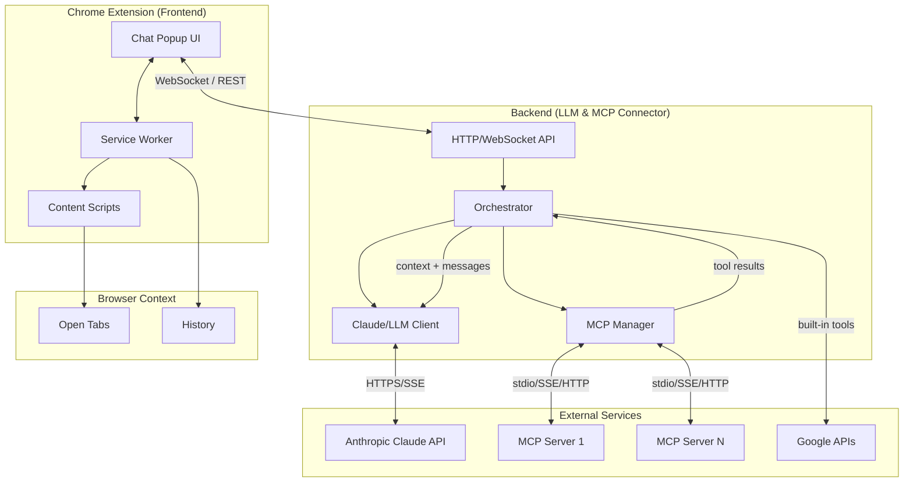

# Personal Assistant

A Chrome extension that provides a Claude-style chat interface, collects browser context from your open (and optionally closed) tabs, and streams responses from a backend that connects to **Anthropic's Claude API** (or other LLMs) and **Model Context Protocol (MCP)** servers. Use it to ask questions about your current page, summarize content, add events to Google Calendar, create Google Docs from summaries, and call external tools via MCP.

---

## Table of Contents

- [Project Overview](#project-overview)
- [Architecture](#architecture)
- [Architecture Diagram](#architecture-diagram)
- [Installation](#installation)
- [Quick Start](#quick-start)
- [Documentation Index](#documentation-index)
- [Configuration](#configuration)
- [Connectors and MCP](#connectors-and-mcp)
- [Voice Input and Read-Aloud](#voice-input-and-read-aloud)
- [Docling (Document Parsing)](#docling-built-in-document-parsing)
- [Deploying the Backend](#deploy-the-backend-on-render)
- [Troubleshooting](#troubleshooting)

---

## Project Overview

**Personal Assistant** is a three-layer system that brings an AI assistant into the browser with access to your open tabs and external tools.

- **What it does:** You chat in a popup; the extension can send the content of your open tabs (as markdown) to the backend. The backend calls an LLM (Claude, OpenAI, or Groq) and optional **MCP (Model Context Protocol)** servers for tools (e.g. calendar, docs, search). Responses stream back in real time. Built-in integrations include **Google Calendar** and **Google Docs** via OAuth; additional tools come from MCP servers you configure.
- **Why it exists:** To give developers and users a single entry point for an assistant that can reason over browser context and use external tools (calendar, docs, search, etc.) without locking them into a single vendor. The backend can be self-hosted (Node or Python), and the extension talks to it over WebSocket and REST.

---

## Architecture

The system has three main layers: the **Chrome extension (frontend)**, the **backend (LLM & MCP connector)**, and **external services** (LLM APIs and MCP servers). Data flows from the user through the extension to the backend, then to Claude (or another LLM) and optional MCP tools; streamed responses flow back to the popup.

### Extension (Frontend)

- **Chat popup:** Renders the conversation UI, sends the user message, triggers context collection when requested, and displays streamed replies (text and tool use/result status).
- **Service worker:** Coordinates the extension: enumerates tabs, triggers content extraction via injected scripts, packages tab content into a single context payload, maintains the WebSocket connection to the backend, and relays auth (e.g. API key or JWT). Sensitive keys are not stored in the popup UI.
- **Content extraction:** Scripts are injected into tab pages (via `chrome.scripting`) to read DOM/content. Content is converted to markdown, truncated per-tab and globally, then sent with the user message. Tabs that cannot be read (e.g. `chrome://`) are skipped or noted in context.

### Backend (LLM & MCP Connector)

You can run either the **Node** (`backend/`) or **Python** (`backend_py/`) backend. Both expose the same WebSocket and REST contracts.

- **HTTP/WebSocket API:** Handles health checks, CORS, and auth (JWT or backend API key). WebSocket endpoint (e.g. `/ws` or `/v1/ws`) accepts JSON messages: auth, chat (message + context), and ping/pong for keepalive.
- **Orchestrator:** For each chat request, builds the LLM request (system prompt, optional browser-context block, user message), calls the LLM with streaming, and aggregates the stream. When the LLM returns **tool_use** blocks, the orchestrator calls the corresponding MCP (or built-in) tools, appends tool results to the conversation, and may call the LLM again until no more tool use or a turn limit is reached.
- **Claude (or LLM) client:** Sends messages to Anthropic (or OpenAI/Groq) with streaming, parses **content_block_delta** events (text and tool_use), and surfaces token usage.
- **MCP manager:** Connects to one or more MCP servers (stdio, SSE, or HTTP). On startup or first use, fetches `tools/list`; on each `tool_use` from the LLM, runs `tools/call` and returns the result to the orchestrator so it can be appended as a tool_result message and the LLM can continue.

### External Services

- **LLM API:** Anthropic Claude (primary), or OpenAI/Groq as configured. The backend sends the conversation (including context and tool results) and streams the response.
- **MCP servers:** Optional. Each server exposes tools (e.g. time, Brave Search, filesystem). The backend spawns or connects to them, aggregates their tools, and passes tool results back into the LLM. **Google Calendar** and **Google Docs** in this project are implemented as built-in tools in the backend (OAuth per user), not as a separate MCP server.

### Data Flow (Summary)

1. User types a message and (optionally) enables “Include tab context” in the popup.
2. Extension service worker collects open tabs, injects scripts to extract content, converts to markdown, applies size limits, and packages context.
3. Popup sends over WebSocket: `{ type: "chat", id, message, context, allow_tools }`.
4. Backend authenticates, then orchestrator builds the prompt (system + context + user message), calls the LLM with streaming.
5. LLM stream is forwarded to the client as `text_delta` (and optionally `tool_use`). If the LLM requests a tool, backend calls MCP (or built-in tool), gets the result, appends it to the conversation, and may call the LLM again.
6. Client displays streamed text and tool status until `done` or `error`.

---

## Architecture Diagram



- **Extension:** Popup and service worker; service worker drives context collection and the WebSocket client; content scripts run inside tab pages to extract content.
- **Backend:** API layer, orchestrator, LLM client, and MCP manager; one backend can serve many extension clients.
- **External:** LLM API and MCP servers (and built-in Google Calendar/Docs) provide model and tools.

---

## Installation

### Prerequisites

- **Chrome** (or Chromium-based browser) to load the unpacked extension.
- **Backend runtime:**  
  - **Node 18+** if using the Node backend (`backend/`).  
  - **Python 3.10+** if using the Python backend (`backend_py/`).
- **API keys:**  
  - LLM: Anthropic (or OpenAI/Groq) API key — can be set in backend `.env` or in the extension under Settings.  
  - Optional: Backend API key or JWT (sign-in) for extension ↔ backend auth.  
  - Optional: Google OAuth client ID/secret for Connectors → Google; Brave API key for Brave Search MCP, etc.

### 1. Clone and choose backend

```bash
git clone <repo-url>
cd PersonalAssistant
```

Use **one** of the two backends:

- **Node (recommended if the extension gets WebSocket 403 with Python):** `backend/`
- **Python:** `backend_py/`

### 2. Node backend (`backend/`)

```bash
cd backend
cp .env.example .env
```

Edit `.env`:

- Set `JWT_SECRET` (required for sign-in). Example: `openssl rand -hex 32`
- Optionally set `BACKEND_API_KEY` for extension auth without sign-in.
- Optionally set `ANTHROPIC_API_KEY` (or leave for extension to send).
- For Google: set `GOOGLE_CLIENT_ID`, `GOOGLE_CLIENT_SECRET`, `GOOGLE_REDIRECT_URI` (e.g. `http://localhost:3000/auth/google/callback`).

Then:

```bash
npm install
npm run dev
```

Server runs at `http://localhost:3000`. Data is stored under `backend/data/`.

For production:

```bash
npm run build
npm start
```

### 3. Python backend (`backend_py/`)

```bash
cd backend_py
python -m venv .venv
# Windows:   .venv\Scripts\activate
# macOS/Linux: source .venv/bin/activate
pip install -r requirements.txt
cp .env.example .env
```

Edit `.env`:

- Set `JWT_SECRET`, and optionally `BACKEND_API_KEY`, `ANTHROPIC_API_KEY`.
- For Google: set `GOOGLE_CLIENT_ID`, `GOOGLE_CLIENT_SECRET`, `GOOGLE_REDIRECT_URI=http://localhost:3000/auth/google/callback`.

Then:

```bash
python main.py
```

Server runs at `http://localhost:3000`. Data is stored under `backend_py/data/`.

### 4. Chrome extension

1. Open Chrome and go to `chrome://extensions`.
2. Enable **Developer mode** (top right).
3. Click **Load unpacked** and select the project’s **`extension`** folder.
4. The Personal Assistant icon should appear in the toolbar.

### 5. Configure the extension

- Open the popup and set **Backend URL** (e.g. `http://localhost:3000`).
- **Sign in:** Create account or Sign in with email/password, **or** in Settings set **Backend API Key** to skip sign-in.
- In **Settings**, set **LLM** provider and API key (and model if applicable).
- Optional: In **Connectors**, connect **Google** (Calendar & Docs) and/or add MCP servers (e.g. Time, Brave Search). For multi-user deployments, use Connectors → Google so each user connects their own account; set `GOOGLE_CLIENT_ID` and `GOOGLE_CLIENT_SECRET` in the backend `.env`.

---

## Quick Start

After [Installation](#installation):

1. **Start the backend** (from `backend/` or `backend_py/`):
   - Node: `npm run dev`
   - Python: `python main.py`
2. **Load the extension** from the `extension/` folder and set Backend URL in the popup.
3. **Sign in** or set Backend API Key in Settings; set **LLM** (provider + API key) in Settings.
4. Open any webpage, then open the extension popup. Optionally leave **Include tab context** checked.
5. Type a message (e.g. *“What is this page about?”*) and send. Responses stream from your configured LLM; if tools are connected, the assistant can use them (e.g. calendar, docs, MCP).

**Minimal test:** With backend running and extension loaded, send “Hello” without context. You should see a streamed reply. Then try “Summarize this page” with a normal page open and tab context included.

---

## Project Structure

```
PersonalAssistant/
├── docs/           # Specifications and references (see table below)
├── extension/      # Chrome extension (manifest, popup, service worker)
├── backend/        # Node (Fastify) backend — use this if Python WebSocket has 403
├── backend_py/     # Python FastAPI backend (LLM & MCP connector)
└── README.md       # This file
```

---

## Documentation Index

| Document | Description |
|----------|-------------|
| [docs/ARCHITECTURE_AND_IMPLEMENTATION_PLAN.md](docs/ARCHITECTURE_AND_IMPLEMENTATION_PLAN.md) | Full architecture, data flow, auth, context extraction, security, tech stack, MCP, permissions, rate limiting. |
| [docs/API_CONTRACTS_AND_PATTERNS.md](docs/API_CONTRACTS_AND_PATTERNS.md) | WebSocket/REST contracts, message shapes, backend and extension code patterns. |
| [docs/PERMISSIONS_REFERENCE.md](docs/PERMISSIONS_REFERENCE.md) | Extension permissions summary and alternatives. |
| [docs/CONNECTORS.md](docs/CONNECTORS.md) | How connectors (Google, Notion, MCP) work and how to add more. |
| [docs/DEMO_CHECKLIST.md](docs/DEMO_CHECKLIST.md) | Demo flow: ask about page, summarize, calendar, Google Docs; official MCP. |
| [docs/EXTERNAL_MCP_FOR_STUDENTS.md](docs/EXTERNAL_MCP_FOR_STUDENTS.md) | External MCP servers for students; config in `data/`; registry. |
| [docs/README.md](docs/README.md) | Doc index and suggested implementation order. |

---

## Configuration

- **Backend:** All options are via environment variables. See `backend/.env.example` or `backend_py/.env.example`. Key variables: `JWT_SECRET`, `BACKEND_API_KEY`, `ANTHROPIC_API_KEY`, `GOOGLE_*`, `PORT`, `DATA_DIR`, `ALLOWED_ORIGINS`, `MCP_SERVERS_JSON` (optional), Docling-related vars (Node backend).
- **Extension:** Backend URL, sign-in or Backend API Key, and LLM provider/API key/model are set in the popup and Settings. Connectors (Google, MCP servers) are configured in the Connectors UI; MCP config can be stored per user in backend `data/mcp-servers.json` or via `MCP_SERVERS_JSON` in `.env`.
- **CORS:** Backend must allow the extension origin (e.g. `chrome-extension://<id>`). Typical: `ALLOWED_ORIGINS=*` for development.

---

## Connectors and MCP

- **Built-in Google (Calendar & Docs):** Implemented in the backend. Use **Connectors → Google** in the extension; each user signs in with their own Google account. Set `GOOGLE_CLIENT_ID` and `GOOGLE_CLIENT_SECRET` in the backend `.env`. No separate MCP server required for Calendar/Docs.
- **Other tools:** Add **MCP servers** via Connectors (Recommended for students / Search more MCP servers) or via `MCP_SERVERS_JSON` in backend `.env`. Examples: Time (`@modelcontextprotocol/server-time`), Brave Search (`@modelcontextprotocol/server-brave-search` with `BRAVE_API_KEY`), Fetch, Memory, Filesystem. The backend runs them (e.g. via `npx`), calls `tools/list` and `tools/call`, and feeds results back to the LLM. See [docs/CONNECTORS.md](docs/CONNECTORS.md) and [docs/EXTERNAL_MCP_FOR_STUDENTS.md](docs/EXTERNAL_MCP_FOR_STUDENTS.md).

---

## Voice Input and Read-Aloud

- **Voice input (mic):** Click the microphone next to the message box. Allow microphone access when Chrome prompts. If the status shows “Microphone denied,” open `chrome://extensions` → Personal Assistant → **Details** and ensure **Microphone** is allowed (or remove and re-add the extension to get the prompt again).
- **Read aloud:** Click the speaker icon to hear the last assistant reply. Send a message and get a response first, then use the speaker to read it aloud.

---

## Docling (Built-in Document Parsing)

The **Node backend** can run [Docling](https://github.com/docling-project/docling) to expose a **parse_document** tool (PDF, DOCX, PPTX, HTML → markdown).

1. **Install Docling** where the backend runs (Python 3.10+). Prefer a virtual environment to avoid permission issues:
   ```bash
   cd backend
   python -m venv .venv
   # Windows:   .venv\Scripts\activate
   # macOS/Linux: source .venv/bin/activate
   pip install docling
   ```
   Alternatively: `pip install --user docling`.
2. **Enable in backend:** In `backend/.env` set:
   ```env
   DOCLING_ENABLED=1
   # If using venv (adjust path for your OS):
   # DOCLING_PYTHON_PATH=./.venv/bin/python
   ```
3. Restart the backend. The model will see **parse_document** and can use it when the user shares a document URL (e.g. “Summarize this PDF: https://…”).

On Render (and most Node-only hosts), Docling is usually **not** available unless you add a Python runtime; leave `DOCLING_ENABLED` unset there.

---

## Deploy the Backend on Render

Only the **backend** is deployed; the Chrome extension stays on users’ machines and points to your backend URL. The steps below target the **Node** backend (`backend/`).

### 1. Create a Web Service

1. Go to [render.com](https://render.com) and sign in.
2. **New → Web Service**.
3. Connect your repo and select this repository.

### 2. Configure the service

| Field | Value |
|-------|--------|
| **Name** | e.g. `personal-assistant-backend` |
| **Region** | Closest to your users |
| **Root Directory** | `backend` |
| **Runtime** | Node |
| **Build Command** | `npm install && npm run build` |
| **Start Command** | `npm start` |
| **Instance Type** | Free (or paid for always-on WebSockets) |

### 3. Environment variables

Add at least:

| Key | Value | Required |
|-----|--------|----------|
| `JWT_SECRET` | Random secret (e.g. `openssl rand -hex 32`) | Yes |
| `BACKEND_API_KEY` | Secret token for extension (optional if using sign-in) | Recommended |
| `PORT` | `3000` (Render often sets this automatically) | No |
| `ALLOWED_ORIGINS` | `*` or your extension origin | Yes for CORS |
| `ANTHROPIC_API_KEY` | Default Claude key (or let users set in extension) | Optional |
| `GOOGLE_CLIENT_ID` / `GOOGLE_CLIENT_SECRET` | If using Connectors → Google | Optional |
| `GOOGLE_REDIRECT_URI` | `https://your-service-name.onrender.com/auth/google/callback` | If using Google |

Do **not** set `DOCLING_ENABLED` on Render unless you add a custom Docker image with Python + Docling.

### 4. Deploy and use

1. Create the Web Service (or Save and let it deploy).
2. Copy the service URL (e.g. `https://personal-assistant-backend.onrender.com`).
3. In the extension, set **Backend URL** to that URL (use `https://`). Sign in or set **Backend API Key** in Settings.
4. Chat and tools will use your Render backend. On the free tier, the service may spin down after inactivity; the first request after idle can be slow.

---

## Troubleshooting

- **WebSocket 403 / connection refused:** Use the **Node** backend (`backend/`) if the Python backend gives 403 from the extension. Ensure backend URL in the extension uses the same scheme and host (e.g. `http://localhost:3000` for local).
- **“Invalid API key” / 401:** Confirm LLM API key in extension Settings or in backend `.env`. For backend auth, check JWT_SECRET or BACKEND_API_KEY and that you’re signed in or using the correct API key.
- **No tab context:** Ensure “Include tab context” is checked and that the tab is a normal HTTP/HTTPS page (not `chrome://` or an extension page). Check extension permissions (`tabs`, `scripting`, `host_permissions`).
- **Google Calendar/Docs not working:** Reconnect **Connectors → Google** so the Docs scope is granted. Set `GOOGLE_CLIENT_ID`, `GOOGLE_CLIENT_SECRET`, and `GOOGLE_REDIRECT_URI` in backend `.env`; for production, set the redirect URI in Google Cloud Console to your backend URL (e.g. `https://your-service.onrender.com/auth/google/callback`).
- **Microphone / read-aloud:** If the mic does nothing, check the status under the chat and ensure the extension has the **Microphone** optional permission in `chrome://extensions`. For read-aloud, send a message and get a reply before using the speaker icon.
- **Rate limits (429):** Backend or LLM may throttle; retry after a short delay. Optionally configure rate limiting per key in the backend.

For implementation details, API contracts, and security, see [docs/ARCHITECTURE_AND_IMPLEMENTATION_PLAN.md](docs/ARCHITECTURE_AND_IMPLEMENTATION_PLAN.md) and [docs/API_CONTRACTS_AND_PATTERNS.md](docs/API_CONTRACTS_AND_PATTERNS.md).
