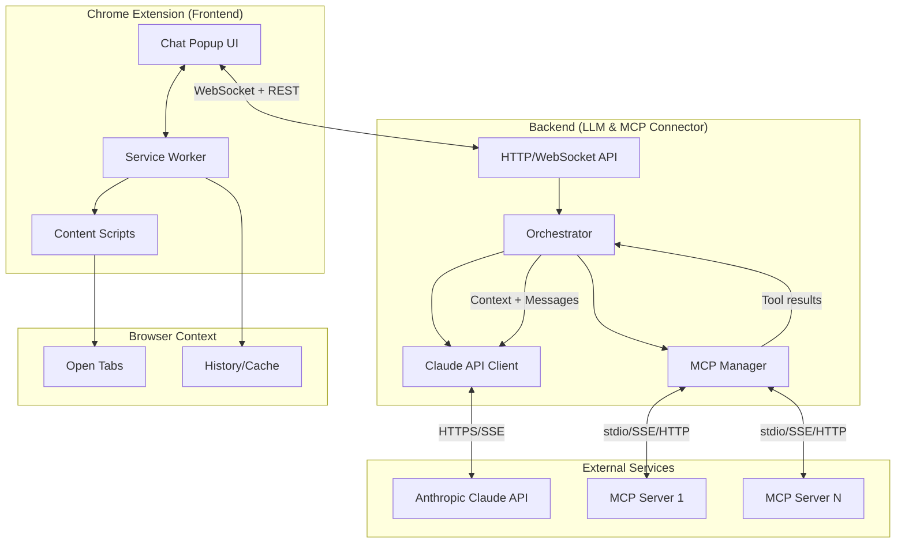
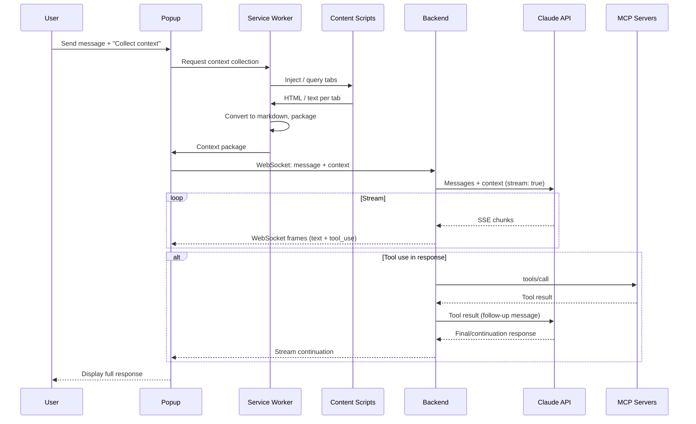
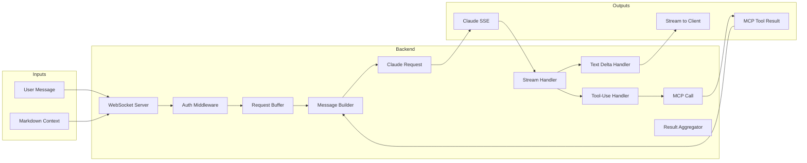

# Chrome Extension + Backend + MCP — Technical Implementation Plan & Architecture Specification

**Version:** 1.0  
**Last Updated:** March 2025  
**Status:** Implementation-ready specification

---

## 1. Executive Summary

This document defines the architecture and implementation plan for a three-layer system:

1. **Frontend:** Chrome extension with a Claude-style chat popup, context collection triggers, and real-time streaming.
2. **Backend:** LLM & MCP connector bridging the extension to Anthropic’s Claude API and MCP servers.
3. **Context collection:** Extraction of open (and, where possible, closed) tab content as markdown for LLM context.

The specification includes architecture diagrams, authentication, context extraction, real-time protocol, security, tech stack, MCP integration, manifest permissions, and rate/token management so a team can implement immediately.

---

## 2. System Architecture

### 2.1 High-Level Architecture Diagram



### 2.2 Data Flow (Core User Flow)



### 2.3 Component Responsibilities

| Component | Responsibility |
|-----------|----------------|
| **Chat popup** | UI, send message, trigger context collection, display streamed replies, show tool/context status. |
| **Service worker** | Tab enumeration, coordination of content scripts, context packaging, WebSocket client, API key relay (no key in UI). |
| **Content scripts** | Run in tab context; extract DOM/HTML or text; return to service worker. |
| **Backend API** | Auth, WebSocket upgrade, session handling, request validation. |
| **Orchestrator** | Build Claude request (system + context + messages), call Claude, parse tool_use, call MCP, resubmit tool results, stream aggregation. |
| **Claude client** | HTTP/SSE to Anthropic, streaming, tool-use parsing. |
| **MCP manager** | Connect to MCP servers (stdio/SSE/HTTP), `tools/list`, `tools/call`, map tool results back to orchestration. |

---

## 3. Architecture Diagram — Detailed Data Flow



---

## 4. Authentication Strategy

### 4.1 Anthropic API

- **Storage:** API key MUST NOT be stored in the extension’s frontend (popup/options). Store only in:
  - **Option A (recommended):** Backend environment variable / secret manager (e.g. `ANTHROPIC_API_KEY`). Extension never sees the key.
  - **Option B:** User enters key in extension options; backend exposes an endpoint that accepts a session token issued after the extension proves it has the key (e.g. hash or one-time token). Key is sent once over HTTPS and then only session token is used.
- **Transmission:** If key is ever sent, use HTTPS only and short-lived tokens where possible.
- **Backend:** Validate API key on first use and cache validity briefly; on 401, clear cache and return clear error to extension.

### 4.2 MCP Server Connections

- **In-process MCP servers (e.g. stdio):** No network auth; rely on process isolation and that only backend spawns them.
- **Remote MCP (SSE/HTTP):**
  - Support optional `Authorization` header from backend config (e.g. per-server API key or Bearer token).
  - Store MCP credentials in backend config/secrets, not in extension.
- **User consent:** Before first tool execution per session (or per server), backend can require a “consent token” from the extension; extension shows a clear “Allow tools for this chat?” and sends token only after user approval.

### 4.3 Extension ↔ Backend

- **Option A — API key in extension:** Extension holds a backend API key (or opaque token). Send in header: `X-API-Key: <token>`. Backend validates and rate-limits by key.
- **Option B — OAuth2 / OIDC:** For multi-tenant or enterprise, backend issues short-lived access tokens; extension uses chrome.identity or similar to get tokens and sends `Authorization: Bearer <access_token>`.
- **Option C — Session cookie:** User logs in via backend web UI; extension uses optional cookie in fetch/WebSocket (ensure SameSite and Secure).

Recommendation: Start with **Option A** for the extension and **backend-held Anthropic key** for simplicity; add OAuth if you need multi-user or enterprise.

---

## 5. Context Extraction Methodology

### 5.1 Overview

- **Goal:** For each “relevant” tab (all open, or filtered by user), get main content and convert to markdown so Claude can reason over it.
- **Stages:** Tab discovery → content extraction → HTML→markdown → size limits → packaging.

### 5.2 Tab Discovery

- **Open tabs:** `chrome.tabs.query({})` (requires `tabs` permission). Optionally filter by window or `activeTab`-only for a “current tab only” mode.
- **Closed tabs:** `chrome.history.search()` with `text: ""` and `startTime` to get recently closed URLs (requires `history` permission). For content, only use cache if available (see below); otherwise send URL + title only as context.

### 5.3 Content Extraction (Open Tabs)

1. **Injection:** From service worker, use `chrome.scripting.executeScript()` with `target: { tabId }` and a function or file that runs in the page.
2. **Extraction options:**
   - **A — Inner text / readability:** Use a readability-like algorithm (e.g. Mozilla Readability or port) to get main content, then serialize to text or simple HTML. Reduces noise and size.
   - **B — Full HTML:** `document.documentElement.outerHTML`. Simple but large and noisy.
   - **C — Structured clone:** Walk DOM, keep headings, paragraphs, lists, links; output a minimal structure that is easy to convert to markdown.
3. **Recommendation:** Prefer A (readability) for “main content” and fallback to B with a strict size cap. Always apply a per-tab and global size limit (see below).

### 5.4 HTML → Markdown

- Use a small, deterministic HTML-to-markdown library (e.g. `turndown` in JS, or backend conversion if you send HTML).
- Preserve: headings (h1–h6), paragraphs, lists, links (as `[text](url)`), code blocks, blockquote.
- Strip: script, style, nav, footer, ads (if not already removed by readability).
- Add a short header per tab: `## Tab: <title> (<url>)\n\n` so Claude can attribute content.

### 5.5 Size Limits

| Limit | Recommended value | Enforcement |
|-------|-------------------|-------------|
| Per-tab markdown | 8,000–16,000 chars | Truncate with “… [truncated]” |
| Total context length | 100,000–200,000 chars (or ~25k–50k tokens) | Truncate oldest tabs or lowest priority |
| Max tabs | 20–30 | Drop excess by recency or user order |

Token estimation: ~4 chars per token for English; use a small tokenizer or `chars/4` for budgeting.

### 5.6 Packaging for Backend

Send a single “context” payload, e.g.:

```json
{
  "tabs": [
    {
      "id": 123,
      "url": "https://example.com/page",
      "title": "Example Page",
      "markdown": "## Tab: Example Page (https://example.com/page)\n\nContent..."
    }
  ],
  "closed_tabs": [
    { "url": "...", "title": "...", "markdown": null }
  ],
  "totalChars": 45000,
  "truncated": false
}
```

Backend builds one or more user/system blocks: e.g. system block: “You have the following browser context (markdown). Use it to answer the user.”; then the concatenated markdown; then the user message.

### 5.7 Closed Tabs and Cache

- Chrome does not expose a general “cached body for closed tab” API. Options:
  - **Cache API:** If the extension or a content script had previously cached the page (e.g. on load), you can read from cache when the tab is closed; otherwise not available.
  - **History only:** For closed tabs, send only URL + title from `chrome.history` and optionally a note in system prompt: “The user had these pages open recently; content is unavailable.”
- Do not rely on `chrome.storage` for full page content unless you explicitly save it when the tab is open.

---

## 6. Real-Time Communication: Extension ↔ Backend

### 6.1 Protocol Choice: WebSocket (Recommended)

- **Why WebSocket:** Low latency, bidirectional, single connection for streaming and optional future push (e.g. “context collection done”).
- **Alternative:** Long-polling or chunked HTTP for streaming; acceptable but more complex and higher latency.

### 6.2 WebSocket API Contract

- **URL:** `wss://<backend>/ws` (or `wss://<backend>/v1/chat/stream`).
- **Authentication:** Send auth in first frame or query param (e.g. `?token=...`) or via a small JSON “init” message: `{ "type": "auth", "token": "..." }`. Backend responds with `{ "type": "auth_ok" }` or `{ "type": "error", "code": "unauthorized" }` and closes.

**Client → Server (extension sends):**

```json
{
  "type": "chat",
  "id": "uuid-v4",
  "message": "User's message text",
  "context": { "tabs": [...], "closed_tabs": [...] }
}
```

**Server → Client (streaming):**

- Text delta: `{ "type": "text_delta", "delta": "chunk" }`
- Tool use start: `{ "type": "tool_use", "id": "tool_use_xyz", "name": "...", "input": {} }` (input may be partial in fine-grained streaming)
- Tool result: `{ "type": "tool_result", "tool_use_id": "...", "content": "..." }` (for UI display)
- Done: `{ "type": "done", "message_id": "..." }`
- Error: `{ "type": "error", "code": "...", "message": "..." }`

**Ping/pong:** Use WebSocket ping/pong or application-level `{ "type": "ping" }` / `{ "type": "pong" }` for keepalive.

### 6.3 Fallback: REST + SSE

If WebSocket is not used:

- **POST** `/v1/chat` with body `{ "message", "context" }`. Response: `Content-Type: text/event-stream`, events: `text_delta`, `tool_use`, `done`, `error`.
- Same auth (e.g. `Authorization` or `X-API-Key` header).

---

## 7. Error Handling and Fallback Strategies

### 7.1 Context Collection

| Failure | Handling |
|--------|----------|
| Tab not accessible (e.g. chrome://) | Skip tab, add entry in context: “Tab N (chrome://…) not readable.” |
| Timeout (e.g. 5s per tab) | Abort that tab, partial context still sent. |
| No tabs / all skipped | Send message and empty or minimal context; backend still calls Claude. |

### 7.2 Backend ↔ Claude

| Failure | Handling |
|--------|----------|
| 429 rate limit | Retry with exponential backoff (e.g. 1s, 2s, 4s); return user-facing “Rate limited; try again in a moment.” |
| 401/403 | Clear cached key if any; return “Invalid API key” to extension. |
| 5xx / network | Retry once or twice; then return “Service temporarily unavailable.” |
| Timeout (e.g. 60s) | Close stream, return partial response + “Response was truncated.” |

### 7.3 Backend ↔ MCP

| Failure | Handling |
|--------|----------|
| MCP server down | Mark server unavailable; continue without its tools; optionally notify user “Tool X unavailable.” |
| tools/call error | Return error as tool result content so Claude can react; do not crash the turn. |
| Timeout on tool call | Return “Tool timed out” as result content. |

### 7.4 Extension ↔ Backend

| Failure | Handling |
|--------|----------|
| WebSocket disconnect mid-stream | Reconnect and optionally “Resume” by message_id if backend supports it; else show partial and “Connection lost.” |
| Auth failure | Show “Please check API key / login” and point to options. |

---

## 8. Security Considerations

### 8.1 API Key Management

- **Anthropic key:** Stored only on backend (env/secret manager). Never in extension code or frontend storage.
- **Backend API key (for extension):** If used, store in `chrome.storage.local` (not sync) and send only over wss/https. Options page over HTTPS only.

### 8.2 CORS

- Backend must set `Access-Control-Allow-Origin` to the extension origin (e.g. `chrome-extension://<id>`) for REST; WebSocket typically does not use CORS but backend should validate Origin header and reject unknown origins.

### 8.3 Content Sanitization

- **Outbound (to Claude):** Strip or escape content that could be interpreted as instructions (e.g. avoid raw user-controlled HTML in system block). Markdown from your own converter is generally safe; be cautious with arbitrary HTML.
- **Inbound (from Claude / MCP):** Do not render raw HTML from model or tools in the popup. Use text or a safe subset (e.g. marked/sanitized markdown-to-DOM). Avoid `innerHTML` with unsanitized data.

### 8.4 Permissions and Least Privilege

- Request only needed permissions: `tabs`, `scripting`, `activeTab`, and optionally `history` if you use closed tabs. Prefer `activeTab` for “current tab only” mode to avoid broad host permissions where possible.
- Do not request `<all_urls>` if you can limit to specific origins the backend uses.

### 8.5 Secure Backend

- HTTPS and WSS only; HSTS. No API keys in logs or error messages.
- Validate and size-limit all inputs (message length, context size, number of tabs).

---

## 9. Tech Stack Recommendations

### 9.1 Backend

| Concern | Recommendation |
|--------|----------------|
| Language | **Node.js (TypeScript)** or **Python** — both have official Anthropic SDKs and MCP SDKs. |
| Framework | **Node:** Fastify or Express. **Python:** FastAPI. Both support WebSocket and async. |
| MCP | Official **@modelcontextprotocol/sdk** (TypeScript) or **mcp** (Python) for client. |
| Deployment | Container (Docker) on cloud (e.g. Fly.io, Railway, GCP Run, AWS ECS). Scale to zero if low traffic. |
| Secrets | Env vars or cloud secret manager (e.g. GCP Secret Manager, AWS Secrets Manager). |

### 9.2 Extension

- **Stack:** Vanilla JS or small framework (e.g. Preact/React) for popup; Manifest V3.
- **Build:** Optional bundler (e.g. Vite, Rollup) for popup and service worker.
- **Markdown:** Turndown (HTML→markdown). Optionally a lightweight markdown renderer in popup (e.g. marked + DOMPurify).

### 9.3 MCP Servers

- Run as subprocesses (stdio) or connect to remote (SSE/HTTP) from backend. Use MCP SDK’s `Client` to connect and call `list_tools()` and `call_tool()`.

---

## 10. MCP Integration Points

### 10.1 Backend as MCP Client

- Backend connects to one or more MCP servers (config-driven: server name, transport, endpoint or command).
- On startup or on first chat: call `tools/list` and cache tool definitions.
- Map Claude’s `tool_use` blocks to MCP `tools/call` by tool name; pass `arguments` from Claude; send back result as a single content block (e.g. text or JSON string).

### 10.2 Tool Result Back into Chat

- Claude API expects tool results in a follow-up message: same `messages` array, add assistant message with `content: [ { type: "tool_use", id, name, input }, ... ]`, then user message with `content: [ { type: "tool_result", tool_use_id, content } ]`.
- Orchestrator: on each `tool_use` from stream, call MCP, then append assistant block + tool_result user block and call Claude again (stream again). Repeat until no more tool_use or max turns (e.g. 5).
- Stream to extension: forward text deltas; when a tool is executed, you can send `tool_result` event so UI can show “Used tool X” and then stream the continuation.

### 10.3 User Consent

- Before first `tools/call` in a session (or per MCP server), backend can require a consent flag. Extension sends `allow_tools: true` in the chat message or in a separate message; popup shows “Claude wants to use tools (list). Allow?” and user confirms.

---

## 11. Browser API Permissions (Manifest)

### 11.1 manifest.json (Manifest V3)

```json
{
  "manifest_version": 3,
  "name": "Personal Assistant",
  "version": "1.0.0",
  "description": "Chat with Claude using browser context and MCP tools",
  "permissions": [
    "tabs",
    "scripting",
    "activeTab",
    "storage"
  ],
  "optional_permissions": [
    "history"
  ],
  "host_permissions": [
    "<all_urls>"
  ],
  "action": {
    "default_popup": "popup.html",
    "default_title": "Open Assistant"
  },
  "background": {
    "service_worker": "service-worker.js"
  },
  "content_scripts": [
    {
      "matches": ["<all_urls>"],
      "js": ["content-extract.js"],
      "run_at": "document_idle"
    }
  ]
}
```

- **tabs:** Enumerate and query tabs (URLs, titles, tab IDs).
- **scripting:** Inject scripts into tabs for content extraction.
- **activeTab:** Access active tab without broad host permission when user invokes from that tab.
- **storage:** Persist backend URL, API key (if stored in extension), user preferences.
- **optional_permissions — history:** For “recently closed tabs”; request at runtime via `chrome.permissions.request({ permissions: ['history'] })` so install does not require history.
- **host_permissions:** Required to inject into arbitrary tabs. If you only support “current tab,” you can try with only `activeTab` and no `<all_urls>` first.

### 11.2 Content Script Notes

- If extraction is done only by injection on demand (no persistent content script), you can remove `content_scripts` and inject a single script via `chrome.scripting.executeScript({ target: { tabId }, files: ['extract.js'] })` from the service worker when collecting context.

---

## 12. Rate Limiting and Token Usage

### 12.1 Backend Rate Limiting

- Per API key (or user): e.g. 60 requests/minute, 10 concurrent streams.
- Use a sliding window or token bucket; return 429 and `Retry-After` when exceeded.
- Optional: per-IP limits for unauthenticated or health endpoints.

### 12.2 Token Usage

- **Claude:** Read `usage` in the last message (input_tokens, output_tokens). Log per request; optionally expose in response to extension for “usage this session.”
- **Quotas:** Optional hard cap per key (e.g. 1M input tokens/day); reject or throttle when exceeded.
- **Context budget:** Enforce total context size (system + context + messages) below model limit (e.g. 200k); truncate context or oldest messages if needed.

### 12.3 Extension-Side

- Throttle “Collect context” (e.g. once per 10s) to avoid excessive tab access.
- Optional: show a simple “Tokens used this session” from backend usage data.

---

## 13. API Contracts Summary

### 13.1 REST (Optional Health / Config)

- **GET** `/health` → `200 { "status": "ok" }`
- **POST** `/v1/chat` (alternative to WebSocket): body `{ "message", "context" }`, response SSE stream (see above).

### 13.2 WebSocket Frames (JSON)

- **Client → Server:** `{ "type": "auth", "token": "..." }`, `{ "type": "chat", "id": "uuid", "message": "...", "context": { ... } }`
- **Server → Client:** `auth_ok`, `text_delta`, `tool_use`, `tool_result`, `done`, `error`, `pong`

### 13.3 Context Object (Same for REST and WebSocket)

```ts
interface ContextTab {
  id: number;
  url: string;
  title: string;
  markdown: string | null;
}

interface ContextPayload {
  tabs: ContextTab[];
  closed_tabs: { url: string; title: string; markdown: string | null }[];
  totalChars?: number;
  truncated?: boolean;
}
```

---

## 14. Implementation Order (Suggested)

1. **Backend skeleton:** Fastify/FastAPI, health, auth middleware, WebSocket upgrade.
2. **Claude client:** Send a single non-streaming message with mock context; then add streaming.
3. **Extension popup:** UI + WebSocket client; send message and mock context; display streamed text.
4. **Context collection:** Tab query, inject script, readability + turndown, size limits, package.
5. **End-to-end:** Real context from extension → backend → Claude; verify stream and display.
6. **MCP:** Connect one MCP server, list tools, map tool_use to tools/call, append tool results and re-call Claude.
7. **Polish:** Error handling, rate limits, token usage, optional history for closed tabs, consent for tools.

---

## 15. References

- [Anthropic Messages API](https://docs.anthropic.com/en/api/messages)
- [Anthropic Streaming](https://docs.anthropic.com/en/docs/build-with-claude/streaming)
- [Model Context Protocol Specification](https://modelcontextprotocol.io/specification/latest)
- [Chrome Extensions MV3](https://developer.chrome.com/docs/extensions/mv3/)
- [chrome.scripting](https://developer.chrome.com/docs/extensions/reference/scripting/)
- [chrome.tabs](https://developer.chrome.com/docs/extensions/reference/tabs/)

---

*This document is the single source of truth for architecture and implementation. Implement backend and extension according to these contracts and security rules.*
